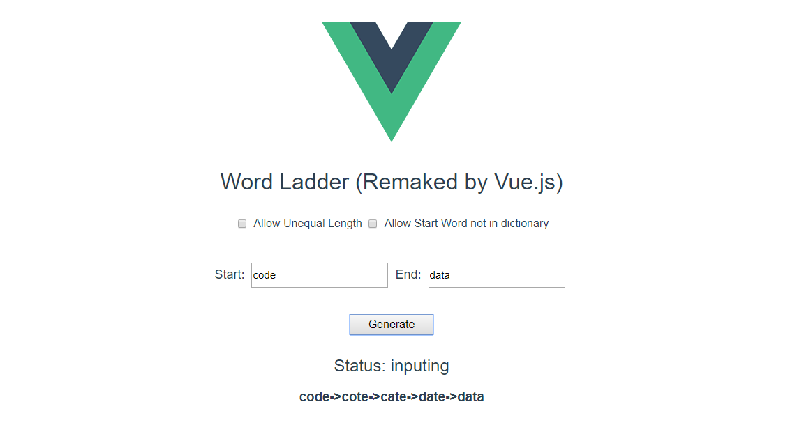
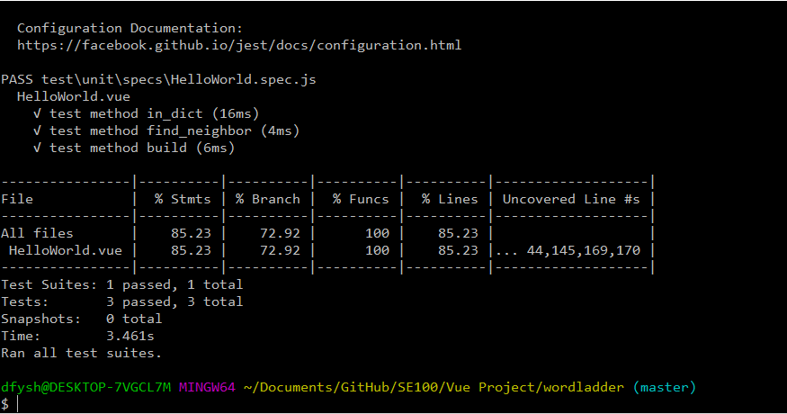

# wordladder

> These project is not fully developed, just a demo.

## Build Setup

``` bash
# install dependencies
npm install

# serve with hot reload at localhost:8080
npm run dev

# run unit tests
npm run unit
```

## Outputs

Page:

Unit Test:

